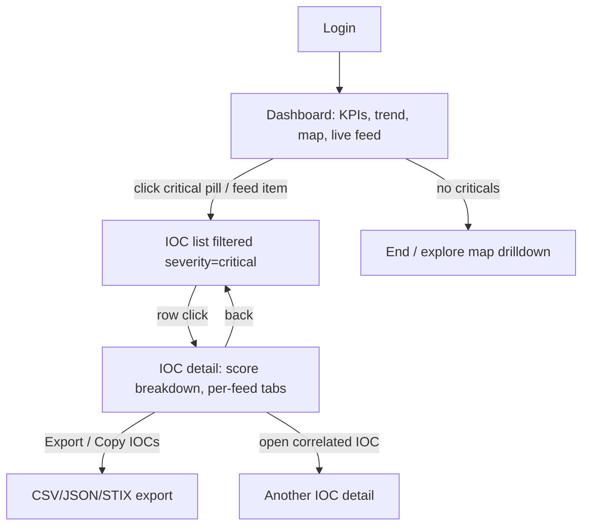
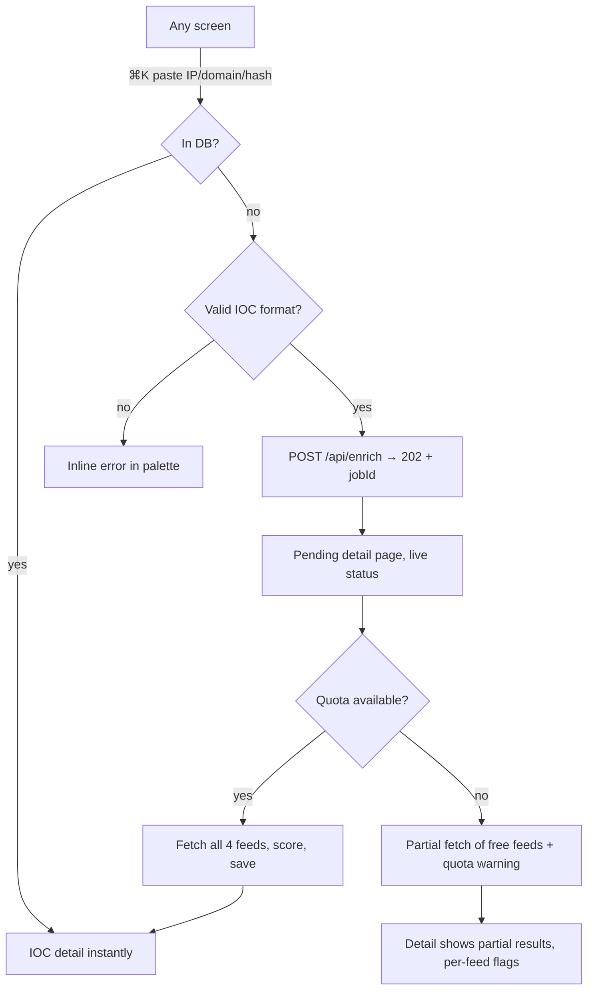
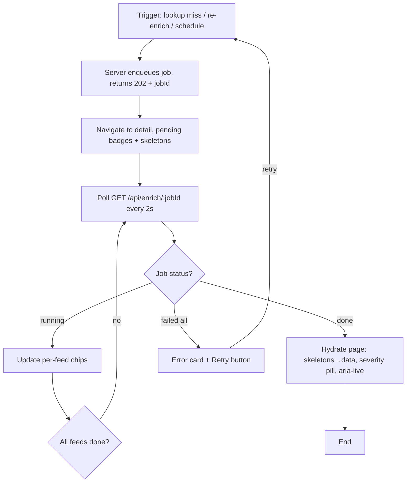
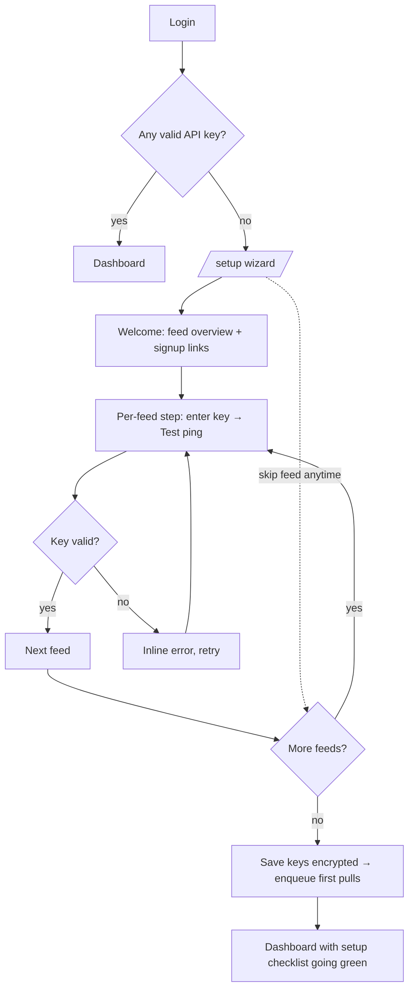

# App Flow — ThreatIntelHub

## Navigation map
```
/login
/setup              (first-run wizard; auto-shown when no API keys)
/dashboard          (default after auth + setup complete)
/iocs               list + filters
/iocs/:id           detail
/reports            digest list + generate
/yara               YARA Studio
/settings           API keys, schedules, quota meters
```
Global ⌘K palette overlays any screen → IOC lookup → jumps to `/iocs/:id`.

## Core journeys

### 1. Daily triage loop (persona: Sam)
1. Login (single admin; expired token redirects to `/login?next=…`).
2. Land on Dashboard: KPIs, trend chart, world map, live feed.
3. Scan live rail / KPI cards; **decision**: anything critical?
   - Yes → click critical pill or feed item → IOC list pre-filtered `severity=critical`.
   - No → optionally browse map country drill-down or end session.
4. In filtered list, click a row → IOC detail: score breakdown, per-feed tabs.
5. **Decision**: act on it?
   - Export/copy IOCs → CSV/JSON/STIX export menu.
   - Investigate further → open correlated IOCs from detail's BarList.
6. Back to list or Dashboard.



### 2. Incident lookup (persona: Dana)
1. From any screen press ⌘K.
2. Paste IP/domain/hash into palette.
3. Client checks DB index → **decision**:
   - **Hit** → jump straight to `/iocs/:id`.
   - **Miss** → show "Not in database — enrich now?" inline option.
     1. Confirm → POST `/api/enrich` with value.
     2. Server validates IOC format → **decision**: valid?
        - Invalid → inline error in palette ("not a valid IPv4/domain/hash").
        - Valid → server returns **202 Accepted** + job id → navigate to placeholder detail page in pending state (see §Async enrichment flow).
4. On completion the same detail page hydrates live.



### 3. Async enrichment flow (202-accepted pattern)
Enrichment is never synchronous — lookups can take 5–30s across four rate-limited APIs.

1. User triggers enrichment (⌘K miss, Re-enrich button, scheduled pull).
2. Server enqueues job, immediately returns **202 Accepted** `{jobId}`.
3. UI navigates to detail page showing **pending state**:
   - Severity pill = outline "pending", pulsing dot.
   - Score card = Skeleton bars, caption "Enrichment running…" + elapsed timer.
   - Each feed row shows its own status chip: queued → fetching → done ✓ / failed ✗ / skipped (quota).
4. UI polls `GET /api/enrich/:jobId` every 2s (exponential backoff to 10s); alternatively SSE stream if configured.
5. **Decision** at each poll:
   - Job `running` → update per-feed chips, keep polling.
   - Job `done` → swap skeleton for real data, badge flips to severity pill, aria-live announcement "enrichment complete".
   - Job `failed` (all feeds) → error card with Retry button; partial feed successes still saved and shown.



### 4. Quota-exhausted UX
Quota counters are first-class; exhaustion degrades gracefully, never dead-ends.

1. Sidebar footer meters show VT `x/500`, AbuseIPDB `x/1000`, reset countdown.
2. Meter crosses ≤20% → amber meter + subtle toast once ("VT quota low").
3. Meter hits 0 → red-outline "exhausted" badge, reset time shown; enrichment buttons get disabled-with-tooltip ("VT quota exhausted, resets HH:MM UTC").
4. Enrichment triggered anyway (race) → pipeline skips exhausted feeds, marks them `skipped-quota`, scores from remaining feeds with lowered confidence, detail page shows per-feed flag "VT: quota exceeded" instead of an error.
5. Scheduled pulls during exhaustion are deferred to post-reset window automatically.
6. Cached results always served first — repeat lookups cost zero quota.

### 5. Report generation (end-to-end)
1. Navigate to `/reports`. List shows past digests (date, type badge: daily/weekly/incident, size).
2. Click **Generate now** → row appears as `queued` with spinner.
3. Job compiles last-24h/7d digest: new criticals, top correlations, feed health, quota usage summary.
4. Poll status → `running` (progress label) → **decision**:
   - `done` → row activates, preview pane renders rendered markdown digest; export DropdownMenu: PDF / Markdown / CSV / JSON / STIX bundle.
   - `failed` → red-outline failed chip + Retry (reuses report-job retry, not enrichment retry).
5. Scheduled daily digest auto-inserts into the same list with a "scheduled" source badge.
6. Preview supports print-friendly rendering before PDF export.

### 6. YARA generation
1. Open YARA Studio → input panel: paste sample strings/hashes or pick linked IOCs from picker.
2. Click Generate → candidate rule appears in editable mono editor (~1–2s).
3. Click Validate → two sequential checks with separate result badges:
   - Compile via yara-python → ✓ pass / ✗ fail with inline error under offending line.
   - Corpus FP scan against stored benign corpus → ✓✓ clean (0 hits) or ✗ N matches listed for rule refinement.
4. **Decision**: both pass?
   - Yes → Save rule (auto-linked to source sample IOCs) or Export `.yar`.
   - No → edit rule, re-validate (loop back to step 3).

### 7. First-run setup wizard
No API keys configured anywhere → app refuses normal dashboard (it would render empty charts).

1. Login succeeds → middleware detects zero valid keys → redirect `/setup` (wizard also reachable from Settings).
2. Step 1 — Welcome: one-screen explanation of which feeds are free vs paid, links to key-signup pages.
3. Step 2–5 — Per feed (OTX → VT → AbuseIPDB → Shodan): masked key input + **Test** button.
   - Test pings each API with the entered key → **decision**: valid?
     - Valid → green check with latency, advance enabled.
     - Invalid/expired → inline error, stay on step.
     - Skipped → user may skip any feed; skipped feeds appear later as "configure" cards in Settings, their panels show empty-state everywhere else.
4. Step 6 — Schedule defaults preview (pull intervals, editable) + summary of chosen feeds.
5. Finish → keys saved encrypted, first pulls enqueued → land on Dashboard showing the setup checklist flipping items to done as feeds come healthy.



## State transitions
- **IOC**: `new` → `pending` (job enqueued, 202 issued) → `enriched` (pipeline done) → `stale` (age decay drops score below display threshold; still queryable). `partial-enriched` when ≥1 feed succeeded but others failed/skipped-quota.
- **Feed**: `healthy` (last pull < interval×2) / `degraded` (errors but retrying) / `down` (cursor stalled); shown as status dot in sidebar + settings.
- **Enrichment job**: `queued` → `running` (per-feed chips updating) → `done | partial | failed` (retryable). Never blocks the HTTP request that created it.
- **Report job**: `queued` → `running` → `done | failed` (retryable).
- **Quota meter**: `ok` (>20%) → `low` (≤20%) → `exhausted` (0, until provider reset window).
- **Session**: expired token → redirect `/login?next=…`; after login, resume the exact route including wizard/pending states.

## Edge cases
- **Quota exhausted mid-enrichment**: partial results flagged per-feed ("VT: quota exceeded"), never a dead error; overall job ends `partial`, score computed from succeeded feeds with confidence penalty noted in breakdown.
- **Duplicate pulse re-ingest**: dedupe key prevents new row; sighting count increments.
- **Empty state first run**: dashboard shows setup checklist instead of empty charts (superseded by full wizard redirect, kept as fallback if user force-navigates).
- **Provider outage mid-pull**: feed marked `degraded`, retries with backoff; existing cached data stays fully browsable; detail tab shows "last successful pull" timestamp.
- **Invalid IOC submitted via ⌘K**: rejected client-side before any API call — no quota burned on malformed input.
- **Concurrent enrichments of same IOC**: second request joins the in-flight job (same jobId returned), no duplicate spend.
- **Clock/reset drift on provider quotas**: meters reconcile from `X-RateLimit-*` response headers on every call rather than trusting local counters alone.
- **Report generation during heavy pull load**: report jobs run on lower queue priority so interactive enrichment wins.
