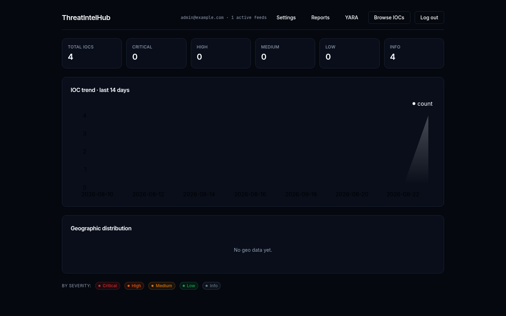
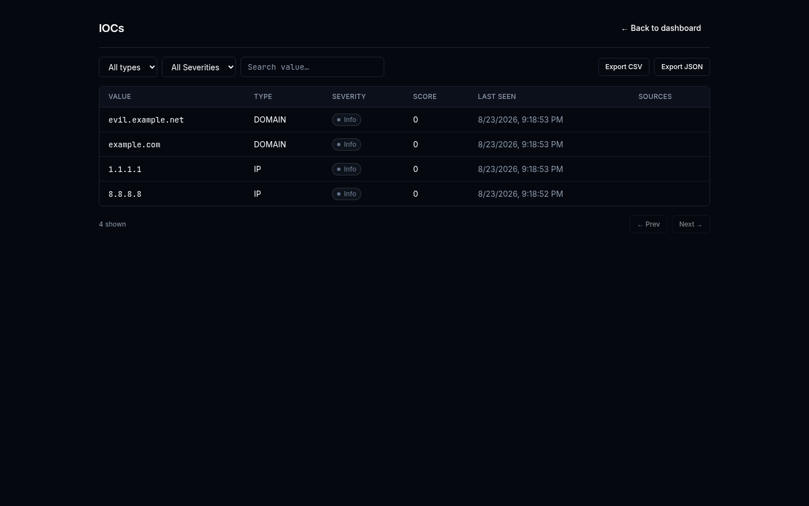
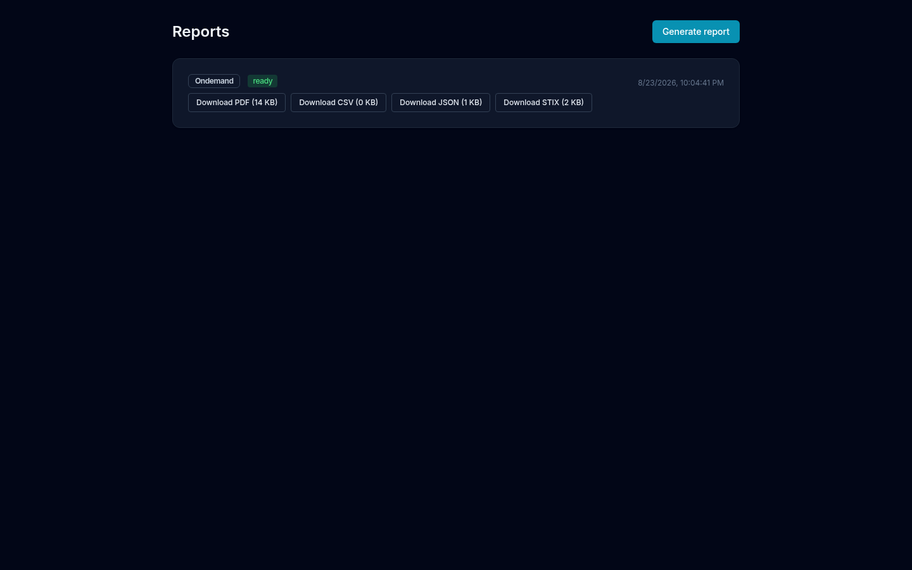
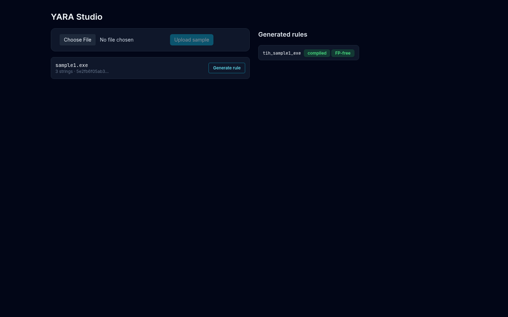

# ThreatIntelHub

<p align="center">
  
</p>

Self-hosted, lightweight **threat intelligence platform** for solo analysts, researchers, and
small security teams. It aggregates free OSINT feeds (AlienVault OTX, AbuseIPDB), performs
on-demand enrichment via VirusTotal and Shodan, correlates IOCs across sources into a
transparent 0–100 threat score, and turns raw indicators into **finished intelligence**:
an interactive dashboard, exportable PDF/CSV/JSON/STIX reports, and an integrated
YARA rule generator.

Runs as a single Docker Compose stack on one host (<2 GB RAM) — a deliberate contrast to
heavyweight TIPs like MISP or OpenCTI.

## Why ThreatIntelHub?

Commercial threat intelligence platforms (Anomali, Recorded Future bundles) cost six
figures a year; open-source ones (MISP, OpenCTI) demand 8–16 GB RAM multi-service stacks
and hours of tuning before producing anything an analyst can act on. Meanwhile the
useful free data — OTX pulses, AbuseIPDB blacklists, VT reputation — is scattered behind
rate-limited APIs that punish careless polling.

ThreatIntelHub exists to close that gap: **one Docker Compose stack, under 2 GB RAM, one
command to start**, that turns those free feeds into scored, correlated, reportable
intelligence — with a scoring formula you can actually read.

| Problem with existing tools | ThreatIntelHub's answer |
|---|---|
| MISP/OpenCTI need multi-service stacks, 8–16 GB RAM, tuning | 5-service Compose stack, one command, <2 GB target |
| Raw event dumps — no analyst-ready output | Auto-generated daily digest reports (PDF/CSV/JSON/STIX) |
| Opaque or manual scoring | Transparent formula: source reliability × age decay + cross-source bonus + sighting bonus, with a per-IOC breakdown UI |
| Free-tier API quotas get burned carelessly | Cache-before-call adapters + Redis token-bucket rate limiting + visible quota counters |
| YARA workflow = separate yarGen + goodware DBs | Built-in YARA Studio: upload → generate → compile → false-positive gate → export |

## How it works

1. **Ingest** — a scheduler worker pulls your subscribed OTX pulses every hour and the
   AbuseIPDB blacklist daily. Every indicator is normalized (lowercased, IP-canonicalized,
   URL-decoded), deduplicated against a unique `(type, value)` key, and recorded as a
   *sighting* tied to its source feed.
2. **Correlate & score** — the moment a sighting lands, the IOC's score is recomputed:
   each source contributes `reliability × exp(-age_hours/720)`, appearing in multiple
   independent feeds adds a +15/+25 cross-source bonus, and repeat sightings add a
   logarithmic bump. Scores map to severity tiers (critical ≥85 … info <15).
3. **Enrich on demand** — looking up an unknown indicator (⌘K palette or API) triggers
   async VirusTotal/Shodan/AbuseIPDB lookups. Every outbound call checks the Redis cache
   first, then a per-source token bucket — free-tier quotas are never blown.
4. **Deliver** — the dashboard aggregates everything into KPIs, a 14-day trend, and a
   geographic choropleth; reports render the same data into PDF/CSV/JSON/STIX 2.1 on
   demand or on a nightly cron; suspicious samples go through the YARA Studio to produce
   compile-checked, false-positive-gated `.yar` rules.

Everything is single-admin and self-hosted: your keys stay Fernet-encrypted in your own
database, and nothing about your deployment leaves your host.

## Screenshots

| | |
|---|---|
|  |  |
|  |  |

## Features

- **Feed ingestion** — OTX pulse pull every hour, AbuseIPDB blacklist daily; VT/Shodan strictly on-demand lookups (free-tier friendly). Cron schedules configurable via env.
- **IOC correlation & scoring** — same indicator seen in multiple feeds scores higher; exponential age decay (720 h half-life); severity tiers critical ≥85 / high ≥65 / medium ≥40 / low ≥15 / info.
- **Dashboard** — KPI tiles per severity, 14-day trend chart (Tremor), world choropleth map, 60 s polling refresh, graceful empty states.
- **IOC triage** — dense searchable list (worst-first ordering, cursor pagination), ⌘K command-palette lookup with async 202-enrich flow, per-source score breakdown, per-feed enrichment tabs.
- **Reports** — on-demand or scheduled daily digest in **PDF / CSV / JSON / STIX 2.1**, downloads audit-logged.
- **YARA Studio** — upload a sample → rarity-ranked string extraction → rule generation → `yara-python` compile check → benign-corpus false-positive gate → `.yar` export.
- **Security** — single-admin auth (argon2id), HttpOnly session cookies, login lockout, Fernet-encrypted API keys at rest (never returned in plaintext), full audit log.
- **Zero-key boot** — works with no API keys configured; add keys later via the Settings UI.

## Quickstart

```bash
git clone https://github.com/Yash-Patil-1/ThreatIntelHub.git
cd ThreatIntelHub

cp .env.example .env
# edit .env: set ADMIN_EMAIL and ADMIN_PASSWORD (min 8 chars)

docker compose up -d --build
docker compose run --rm api alembic upgrade head   # first boot only

# open http://localhost:3000 and sign in
```

> The `alembic upgrade` step creates the schema; the admin user is seeded automatically
> from `ADMIN_EMAIL` / `ADMIN_PASSWORD` on first boot.

### Configuration (`.env`)

| Variable | Required | Purpose |
|---|---|---|
| `ADMIN_EMAIL` / `ADMIN_PASSWORD` | ✅ | Initial admin account |
| `POSTGRES_PASSWORD` | recommended | DB password (change from default `tih`) |
| `OTX_API_KEY` etc. | optional | Feed keys (see below) |
| `INGEST_OTX_CRON` / `INGEST_AIPDB_CRON` / `REPORT_DAILY_CRON` | optional | Cron overrides (UTC) |

## API keys — how to obtain (all free tiers)

ThreatIntelHub works with **zero keys**, but each key unlocks more data. Keys can be
entered in the UI (**Settings → Feed Sources**, stored Fernet-encrypted) or in `.env`.

### 1. AlienVault OTX (scheduled hourly pulls — the main data source)

1. Create a free account at **https://otx.alienvault.com** → *Register*.
2. After login, your API key is shown on your profile page (**Settings → API Key**), or at
   `https://otx.alienvault.com/settings` — copy the 64-hex key.
3. Paste into Settings UI as the `otx` provider, or set `OTX_API_KEY=…` in `.env`.
4. Subscribe to threat pulses on OTX (the "Subscribed pulses" are what gets pulled hourly).

### 2. AbuseIPDB (daily blacklist + IP reputation)

1. Sign up at **https://www.abuseipdb.com/register** (free account).
2. Go to **https://www.abuseipdb.com/account/api** → *Create Key*.
3. Free tier: **1,000 checks/day**, blacklist download **5×/day** (10k IPs per pull).
4. Paste as the `abuseipdb` provider / `ABUSEIPDB_API_KEY=…`.

### 3. VirusTotal (on-demand file/IP/domain reputation) ⚠️

1. Create an account at **https://www.virustotal.com** → *Sign up*.
2. Copy your key from **https://www.virustotal.com/gui/user/{username}/apikey**.
3. Free tier: **4 requests/min, 500/day** — and **non-commercial use only**. Do not use in
   a commercial deployment without VT's consent or a paid tier.
4. Paste as the `virustotal` provider / `VIRUSTOTAL_API_KEY=…`.

### 4. Shodan (on-demand host lookup)

1. Register at **https://account.shodan.io/register**.
2. Your API key is shown at **https://account.shodan.io** immediately after signup.
3. Host lookups (`/shodan/host/{ip}`) are free; the general search endpoint costs credits
   and is **disabled in v1** by design.
4. Paste as the `shodan` provider / `SHODAN_API_KEY=…`.

After adding keys, feeds flip from `disabled` to active on their next scheduled run
(or trigger manually — see below).

## Architecture

```
┌──────────┐   cron    ┌─────────────────┐
│ Next.js  │◀──REST──▶ │  FastAPI (api)   │──▶ PostgreSQL 16
│  :3000   │           │  auth/iocs/      │
└──────────┘           │  dashboard/      │──▶ Redis (cache, rate limits)
                       │  reports/yara    │
                       └───────┬─────────┘
                               │ APScheduler (worker)
                               ▼
                    feed adapters ×4 (cache-before-call, token bucket)
                    OTX · AbuseIPDB · VirusTotal · Shodan/InternetDB
```

- **Backend** — Python 3.12, FastAPI, SQLAlchemy async, Alembic migrations
- **Worker** — APScheduler: OTX hourly, AbuseIPDB daily, nightly score sweep, daily report
- **Frontend** — Next.js 14+ App Router, TypeScript, Tailwind, shadcn/ui, Tremor charts, react-simple-maps
- **Reports** — WeasyPrint (PDF), native STIX 2.1 JSON bundles
- **Rules** — yara-python with benign-corpus validation gate

### Scoring formula (v1)

```
score = Σ(source_reliability × exp(-hours_since_sighting / 720))
      + 15 if seen in ≥2 sources (+25 if ≥3)
      + log2(1 + sightings) × 5        (capped at 100)
```

Reliability weights: VirusTotal 0.9 · AbuseIPDB 0.8 · Shodan 0.7 · OTX 0.6 · other 0.5.
Every IOC detail page shows the exact per-source contribution behind its score.

## Operations

```bash
# trigger a feed pull manually
docker compose exec worker python -c \
  "import asyncio; from app.ingest.jobs import run_ingest_job; asyncio.run(run_ingest_job('otx'))"

# logs / health
docker compose logs -f worker
curl localhost:8000/healthz
```

## Project documentation

Full planning docs live in [`docs/`](./docs/): [PRD](docs/PRD.md) ·
[TRD](docs/TRD.md) · [UI/UX brief](docs/UI_UX_DESIGN_BRIEF.md) ·
[App flow](docs/APP_FLOW.md) · [Backend schema](docs/BACKEND_SCHEMA.md) ·
[Implementation plan](docs/IMPLEMENTATION_PLAN.md) · [Research notes](docs/RESEARCH_NOTES.md)

## Contributing & Security

See [CONTRIBUTING.md](CONTRIBUTING.md) and [SECURITY.md](SECURITY.md).

## License

[AGPL-3.0](./LICENSE)
