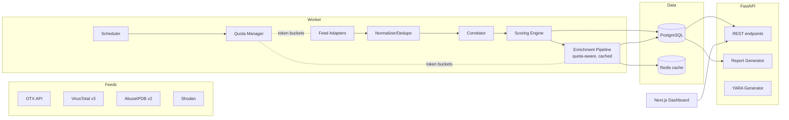
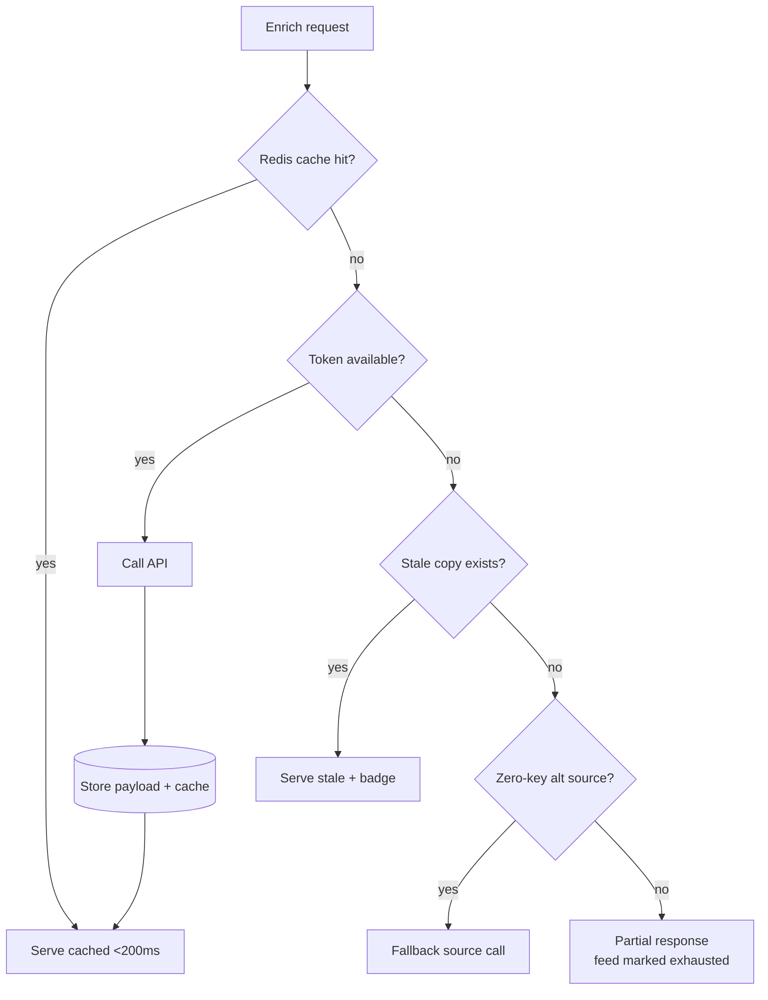

# TRD — ThreatIntelHub

## Stack (and why)
| Layer | Choice | Why |
|---|---|---|
| Backend | **Python 3.12 + FastAPI** | Async HTTP for feed pulls; ecosystem for intel libs (OTXv2, yara-python, stix2) |
| Scheduler/queue | **APScheduler inside worker process** (ponytail: no Celery+broker until job volume demands it) | Feed polling is cron-shaped, not event-shaped |
| DB | **PostgreSQL 16 + SQLAlchemy 2.0 (async)** | JSONB for raw per-feed payloads; PostGIS optional later |
| Cache | **Redis** | Enrichment cache, rate-limit token buckets, scheduler locks |
| Frontend | **Next.js 14 (App Router) + TypeScript + Tailwind + shadcn/ui** | Component ecosystem per UI_UX_DESIGN_BRIEF.md |
| Charts/maps | **Tremor (charts), react-simple-maps (choropleth)** | See UI_UX_DESIGN_BRIEF.md |
| Reports | **WeasyPrint** (HTML→PDF templates) | No headless browser dependency |
| Deploy | Docker Compose: api / worker / postgres / redis / web | Single-host; whole stack targets <2GB RAM (vs OpenCTI ~16GB per RESEARCH_NOTES.md) |

## Architecture

## Key components

1. **Feed adapters** (`feeds/{otx,virustotal,abuseipdb,shodan}.py`)
   - *Responsibility*: one interface — `fetch_since(cursor) -> list[RawIndicator]` plus `enrich(indicator) -> RawPayload` for on-demand sources. Each adapter owns its own quota client handle.
   - *Interfaces*: registered in an adapter registry keyed by feed name; plugin surface for community adapters (PRD §Open Source Strategy). Zero-key adapters (Shodan InternetDB, CVEDB) need no key check.
   - *Failure modes*: upstream 4xx/5xx → retry with exponential backoff (max 3), then mark run failed and persist cursor unchanged; schema drift → contract test fails in CI, runtime falls back to storing raw payload with `parse_errors` counter rather than dropping data. Missing API key → adapter reports `NOT_CONFIGURED`; scheduler skips silently, UI shows a "not configured" badge.

2. **Scheduler** (APScheduler in worker process)
   - *Responsibility*: fires scheduled jobs (OTX hourly, AbuseIPDB blacklist daily, digest nightly) and serializes on-demand jobs. Distributed lock via Redis so api+worker never double-run.
   - *Interfaces*: job registry; every job records last-success timestamp and result to DB (visible in UI health panel).
   - *Failure modes*: missed runs (host asleep) → `misfire_grace_time` + coalescing, never thundering-herd catch-up loops against quota-limited APIs.

3. **Quota Manager**
   - *Responsibility*: single choke point enforcing per-feed budgets via Redis token buckets matching documented free tiers (RESEARCH_NOTES.md): VT 4/min + 500/day, AbuseIPDB check 1000/day + blacklist 5/day, Shodan ~1 req/s, OTX generous but still bucketed. Reserves tokens *before* dispatch; on-demand user requests get priority over scheduled pulls when budget is low.
   - *Failure modes*: bucket empty → caller gets `QuotaExhausted`, enrichment returns cached/stale data with a "stale" badge instead of erroring.

4. **Normalizer/Dedupe**
   - *Responsibility*: canonicalize values (IP→int, domain lowercase/punycode, hash→case-folded md5/sha1/sha256 by length), infer STIX SCO type, dedupe key `(type, normalized_value)` enforced as unique constraint.
   - *Failure modes*: unparseable value → quarantined row + counter, never crashes the batch; re-ingest updates existing rows (upsert), target >95% dedupe rate.

5. **Correlator**
   - *Responsibility*: groups sightings by dedupe key across sources within window (default 72h); maintains denormalized `correlation_count`, `source_set`.
   - *Failure modes*: clock-skewed source timestamps → uses ingestion time for window math; recomputes group membership incrementally on new sighting only.

6. **Scoring engine**
   - *Responsibility*: transparent formula (BACKEND_SCHEMA.md §scoring): source reliability weights × exponential age decay × sighting count × cross-source agreement bonus. Thresholds ≥85/65/40/15. Recompute triggered by new sighting/enrichment events only — never per request.
   - *Interfaces*: weights in a versioned config table; formula rendered verbatim on every IOC page.
   - *Failure modes*: unknown source weight defaults to lowest tier, so unvetted feeds can't inflate scores.

7. **Enrichment pipeline**
   - *Responsibility*: on-demand per IOC through Quota Manager; Redis cache TTL 24h default (per-feed override possible); stale-on-error policy above.
   - *Failure modes*: partial enrichment (some feeds exhausted/down) returns what's available with per-feed status flags — never all-or-nothing.

8. **Report generator / YARA generator / Plugin interface**
   - Report: Jinja2 HTML → WeasyPrint PDF; also MD/CSV/JSON, STIX-JSON export; audit-logged.
   - YARA: candidate strings ranked by rarity heuristic → rule emitted → `yara.compile()` validation → optional benign-corpus scan gates acceptance (unvalidated rules flagged).
   - Plugin interface: adapters/enrichers/report templates implement small documented protocols; core never imports plugin code directly (entry-point style loading).

### Component failure-isolation rule
Any component throwing during a batch affects at most its own unit of work. One feed down never blocks others; one bad IOC row never blocks its batch; report generation failure never touches stored data.

## Free-tier quota strategy

All data sources are free or free-tier; users supply their own keys via `.env`. Zero-key sources preferred where they exist.

### Source inventory & budgets
| Source | Auth | Free limits (RESEARCH_NOTES.md) | Usage mode v1 |
|---|---|---|---|
| OTX | API key (free) | Generous; still bucketed | Scheduled hourly pull |
| VirusTotal v3 | API key (free) | **4 req/min, 500 req/day — non-commercial use only** | On-demand only |
| AbuseIPDB | API key (free) | Check 1000/day; blacklist 5/day (10K rows) | Blacklist daily scheduled; checks on-demand |
| Shodan host lookup | API key (free) | `/shodan/host/{ip}` costs no credits; ~1 req/s | On-demand only |
| Shodan InternetDB + CVEDB | **No key needed** | Unauthenticated, rate-limited politely | Zero-key fallback + bulk IP posture |
| Shodan host/search | API key | Costs credits | Won't (v1) |

> **Prominent constraint**: VT's free tier is licensed for **non-commercial use only**. Docs and UI display this notice wherever a VT key is configured; commercial users are directed to VT Premium. This is a product constraint, not an implementation detail.

### Budgeting rules
1. **Reserve before dispatch**: every outbound call reserves from a Redis token bucket first; nothing hits the wire without a token.
2. **Priority order under scarcity**: user-initiated on-demand > watchlist/alert-driven > scheduled pulls > speculative backfill.
3. **Daily budget guardrails**: VT capped at 400/day in practice (100 headroom for manual lookups); AbuseIPDB blacklist consumes ≤5 calls/day by design.
4. **Cache-first**: any lookup within TTL (24h default; 7d for Shodan host history which changes slowly) served from Redis without spending quota. Stale-serving allowed with badge when quota exhausted.
5. **Scheduled pulls sized to fit**: OTX hourly cursor-pulls are incremental; AbuseIPDB blacklist is 1 call covering 10K rows — cheap daily win.
6. **Zero-key degradation ladder** per feed: full key → zero-key alternative (e.g., InternetDB when no Shodan key) → cached/stale → skipped-with-badge. Absent key is a supported steady state, not an error state.

## Deployment topology

Single Docker Compose stack, five services, single host:

| Service | Image basis | Resource target |
|---|---|---|
| `api` | FastAPI + uvicorn | ~256MB |
| `worker` | Same codebase, APScheduler entrypoint | ~512MB |
| `postgres` | postgres:16-alpine | ~512MB (at 1M IOC rows) |
| `redis` | redis:7-alpine, maxmemory 256MB, allkeys-lru | ≤256MB hard-capped |
| `web` | Next.js static export served by nginx OR Node standalone | ~128–256MB |

- **Footprint goal: <2GB total RAM** — the headline number vs OpenCTI's ~16GB multi-service requirement (RESEARCH_NOTES.md). Verified each release via `docker stats` soak (PRD success metrics).
- Volumes: named volumes for pgdata + report artifacts; `.env` mounted read-only into api/worker for keys.
- Profiles: `docker compose --profile minimal` runs api+worker+pg+redis without the web container (API-only headless mode).
- Healthchecks on all five services; compose `depends_on` with condition gates startup order.
- Backup story: single `pg_dump` cron example in README covers all durable state (reports regenerate, cache is disposable).

## Non-functional requirements
- **Performance**: dashboard p95 < 500ms (server-rendered + paginated tables); enrichment cold <5s, warm <200ms; report end-to-end p95 <30s.
- **Scale target**: 1M IOC rows, 50K/day ingestion comfortably within footprint; partition `sightings` by month when >10M rows (deferred, ponytail note in BACKEND_SCHEMA.md).
- **Security**: admin auth (session cookie, argon2id hash, 5-fails/15min lockout), API keys Fernet-encrypted at rest (master key from env), SSRF-safe fetch (no user-supplied URLs fetched server-side in v1), audit log of exports and auth events.
- **Reliability**: feed failures isolated per adapter; retry w/ backoff (max 3); last-success cursors persisted; scheduler misfire-coalescing; whole-stack restart resumes cleanly from cursors with no duplicate ingest (>95% dedupe verified).

### Security hardening notes (self-hosted single-admin)
ThreatIntelHub runs exposed-to-internet on cheap VPSes by design; assume hostile network:
1. Bind non-data services to localhost/Compose network only — only `web` (or `api` in minimal profile) publishes ports; recommend fronting with Caddy/Traefik TLS reverse proxy (documented, not bundled).
2. Session cookies: HttpOnly, Secure, SameSite=Lax; fixed 12h expiry with rotation on login.
3. Argon2id params pinned (OWASP-recommended baseline); login rate-limited in-app regardless of proxy.
4. Secrets hygiene: `.env` in `.gitignore` from day one; keys encrypted at rest; settings UI masks keys; logs scrubbed by a centralized filter that redacts anything matching key-shaped patterns.
5. Docker: containers run as non-root user; `postgres` not port-mapped to host by default; read-only filesystem where feasible except declared volumes.
6. Dependency posture: Dependabot + pip-audit/npm-audit in CI; base images pinned by digest.
7. Audit trail: exports, logins, key config changes written to append-only `audit_log` table.
8. Outbound-only architecture: the stack makes no inbound-required connections beyond the dashboard port; no webhooks/listeners in v1 shrinks attack surface deliberately.

## Integrations
Four OSINT APIs exactly as specified in RESEARCH_NOTES.md (auth headers, endpoints, quotas). Keys stored in `.env` / settings table (Fernet-encrypted), never logged. Zero-key sources (Shodan InternetDB/CVEDB) usable out of the box with no configuration.

## Tech risks
1. **VT non-commercial restriction** → position VT usage for research/personal deployments; prominent docs/UI notice (see PRD Risks #1 and §Free-tier quota strategy).
2. **react-simple-maps unmaintained-ish** → fallback MapLibre (see UI brief); choropleth topojson is static so risk low.
3. **WeasyPrint system deps (pango/cairo)** in Docker image → pin in Dockerfile early, verify in Phase 1 image build.
4. **Quota-manager bugs burn user quotas silently** → token-bucket state observable in UI health panel; integration test asserts zero 429s across simulated week.
